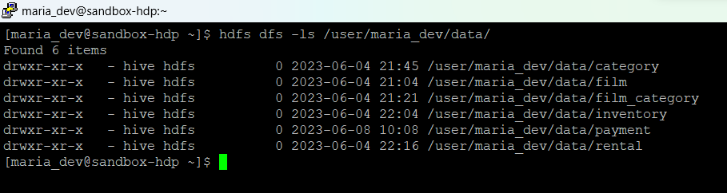

# Data Engineering Project

This project is part of the learning path for taught by Data Growth Community, specifically for the Data Engineer profile. DGC is a data science and Big Data study community with greater scope and potential in young professionals from all over Latin America.


## Description

This project aimed to migrate data from a relational database to Hive, and subsequently perform value analysis using data visualization tools like Power BI.

## Table of Contents

- [Scope](#scope)
- [Solution Diagram](#solution-diagram)
- [Tools](#tools)
- [Installation](#installation)
- [Steps Followed](#steps-followed)
- [Conclusions](#conclusions)

## Scope

In this project, we aimed to migrate data from a relational database to Hive, selecting the necessary tables for future analysis or ETL processes.

## Solution Diagram

The following diagram illustrates the overall solution:


## Tools

In this project, we used the following tools:
- VirtualBox: A virtualization platform that allowed us to create and manage virtual machines. We used VirtualBox to create a virtual machine and install Hadoop and Hive on it.
- PuTTY: A terminal client that enabled us to securely connect to the virtual machine using SSH protocol. We used PuTTY to access the command line of the virtual machine and execute commands related to Hadoop and Hive.
- WinSCP: A file transfer client that facilitated the copying of files between the local machine and the virtual machine. We used WinSCP to transfer configuration files, scripts, and data between our local machine and the virtual machine.

## Installation

To install the virtual machine with Hadoop and Hive, follow these steps:

1. Download the Cloudera virtual machine from the following link: [Cloudera Hortonworks Sandbox](https://www.cloudera.com/downloads/hortonworks-sandbox/hdp.html?utm_source=mktg-community).
2. Follow the installation instructions provided by Cloudera to set up the virtual machine in your environment.
3. Once the virtual machine is installed, ensure that you have access to it through PuTTY and WinSCP to execute commands and transfer files.
4. To connect Hive with Power BI, it is necessary to download and install the [ODBC connector](https://www.cloudera.com/downloads/connectors/hive/odbc/2-6-11.html) (32 or 64-bit, depending on your Power BI version), and then configure it using the HIVE option.

## Steps Followed

The project consisted of the following steps:

1. Import the "sakila-schema.sql" and "sakila-data.sql" files that contain the structure and data of the mentioned database.
2. Move the files to the `/home/` location in the virtual machine.
3. Access the MySQL client in the virtual machine using the following command:
   ```markdown
   $ mysql -u root -p
   ```
4. Create the database by executing the following statement:: 
   ```MARKDOWN
   $ CREATE DATABASE sakila;
   ```
5. Run the following command within MySQL to create the tables:
	```MARKDOWN
	mysql> SOURCE /home/sakila-schema.sql;
	```
6. Run the following command within MySQL to populate the tables:
	```MARKDOWN
	mysql> SOURCE /home/sakila-data.sql;
	```
7. Before starting the data migration from the virtual machine, create the data folder where the Hive tables will be stored. Use the following command:
	```MARKDOWN
	$ hdfs dfs -mkdir /user/maria_dev/data/
	```
8. Analyze the database and select more than 4 tables to migrate to Hive. In this case, the following tables were selected: ***category***, ***film***, ***film_category***, ***inventory***, ***payment*** and ***rental*** For this, the ***final_project*** database and the tables in Hive were created using Ambari, with the following HQL commands:
	- To database:
		```MARKDOWN
		CREATE DATABASE final_project;
		```
	- To film table:
		```MARKDOWN
		CREATE TABLE final_project.film (
		  film_id SMALLINT,
		  title STRING,
		  description STRING,
		  release_year INT,
		  language_id TINYINT,
		  original_language_id TINYINT,
		  rental_duration TINYINT,
		  rental_rate DECIMAL(4,2),
		  length SMALLINT,
		  replacement_cost DECIMAL(5,2),
		  rating STRING,
		  special_features ARRAY<STRING>,
		  last_update TIMESTAMP
		)
		LOCATION '/user/maria_dev/data/film /';
		```
9. After creating all the tables, we can verify them in Ambari:
	
	You can also verify them from the terminal using the command:
	```MARKDOWN
	$ hdfs dfs -ls/user/maria_dev/data/
	```
	You get something like this:
	
	The tables will be empty.
10. Use Sqoop to perform the migration. For example, for the film table, execute the following command:
	```MARKDOWN
	$ sqoop import --connect jdbc:mysql://localhost/sakila --table film --username root --password hortonworks1 --hive-import --hive-database 'final_project' --hive-table 'film'
	```
	The migration may take a few minutes. Once the data migration is complete, you can verify the contents of the film folder by running the command:
	```MARKDOWN
	$ hdfs dfs -ls /user/maria_dev/data/film
	```
	The output should be similar to the following:
	
11. After migrating all the necessary tables for further analysis, establish a Hive connection with Power BI Desktop, as shown below:
	
12. Finally, create a dashboard with the loaded tables in Power BI. [Dashboard](https://app.powerbi.com/view?r=eyJrIjoiOWY1Y2FhZmYtMjE3MC00MmIxLWE4YTktYWQwMjg1Y2FiYTRlIiwidCI6IjFlYmE0NDNmLTIzZTUtNDUzNC05MGQxLTA5NzZhYWJlODZhYyIsImMiOjR9)

## Conclusions
This project allowed me to solidify my knowledge of Hadoop by specifically migrating and manipulating data from a relational database to Hive using tools like Sqoop. Additionally, we performed value analysis using data visualization tools.
